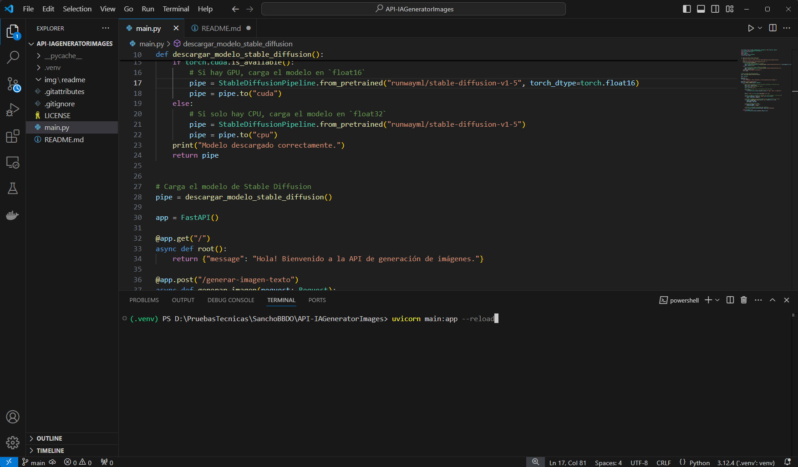

# API-IAGeneradorImágenes

Esta API, desarrollada con FastAPI, te permite generar imágenes a partir de texto utilizando el modelo Stable Diffusion.

## Funcionalidades:

* Recibe un prompt (texto) en una solicitud POST.
* Genera una imagen a partir del prompt usando Stable Diffusion.
* Devuelve la imagen generada directamente en la respuesta HTTP.

## Tecnologías utilizadas:

<div style="display: flex; justify-content: space-around;">
  
  
  
  
  
</div>

* **FastAPI:** Framework web moderno y de alto rendimiento para construir APIs en Python.
* **Stable Diffusion:** Modelo de aprendizaje automático de última generación para la generación de imágenes a partir de texto.
* **PyTorch:** Librería de aprendizaje profundo que proporciona flexibilidad y velocidad para el entrenamiento y la inferencia de modelos como Stable Diffusion.
* **Firebase:** es la plataforma elegida para este proyecto por su facilidad de integración y la variedad de servicios que ofrece. Firestore, su base de datos NoSQL,  permite un desarrollo ágil gracias a su estructura flexible y escalabilidad automática. Además,  Firestore facilita la sincronización de datos en tiempo real, ideal para aplicaciones colaborativas o que requieren actualizaciones instantáneas, con la ventaja de un manejo eficiente del almacenamiento y la posibilidad de trabajar sin conexión.

Esquema general del proyecto:


## Configuración (GIT-HUB):

1. **Clonar el repositorio:**

   ```bash
   git clone [https://github.com/KemmerDesign/API-IAGeneratorImages.git](https://github.com/KemmerDesign/API-IAGeneratorImages.git)
 
2. **Crear el Enviroment (Entorno)**

    Para crear un entorno virtual para este proyecto, se recomienda ejecutar el siguiente comando en la terminal:

     ```bash: python -m venv .venv```

    Para activar el entorno virtual, utiliza el siguiente comando (recuerda que debes estar en la misma carpeta donde creaste el entorno):

    ``` bash: .venv/Scripts/activate ```

    Esto activara el entorno de pruebas en el que se va a trabajar; ya teniendo el entorno activado debemos proceder a instalar las siguientes librerias que son indispensables para que el proyecto corra:

3. **Instalar librerías necesarias para este proyecto**

    ```
    pip install fastapi uvicorn
    pip install diffusers transformers
    pip install torch torchvision torchaudio
    pip install torch
    pip install python-dotenv
    pip install python-multipart
    pip install accelerate
    pip install python-jose[cryptography]
    pip install firebase-admin
    pip install passlib
    pip install bcrypt
    pip install streamlit
    python.exe -m pip install --upgrade pip
    ```
    Asegúrate de estar en la terminal, en el directorio donde se encuentra el archivo **main.py**, y con el entorno virtual activado. Luego, ejecuta el siguiente comando para iniciar el servidor de FastAPI:

4. **Lanzando la API (FastAPI / Streamlit)**

    **FastAPI**
    Debes revisar que estando en la terminal estas en el mismo directorio en el que esta el archivo **main.py**, y adicional verifica que tienes el entorno de ejecución activado, el comando para lanzar el servidor es el siguiente:

    ```bash: uvicorn main:app --reload```
    
    

    Cuando ejecutes el comando si es la primera vez tardara un tiempo en lo que descarga el modelo Stable Diffusion que se usara para desplegar esta aplicación, debes tener paciencia:

    

    Una vez se halla terminado de ejecutar el servidor deberia estar en funcionando correctamente:

    

    **Streamlit**

    En una nueva terminal se puede ejecutar Streamlit con la siguiente linea de comandos ```bash: streamlit run views/frontend.py``` en este caso el archivo **frontend.py** esta dentro de la carpeta views, si se llega a mover este archivo por favor tener en cuenta a que lugar se mueve para ejecutar esa linea de comandos:

    

    En la mayoría de los casos se abrira una pagina web con la pagina renderizada para poder empezar usarla, en el caso que no en la terminal de ejecucion se suministra el **URL = htt9://192.16.2.22:8501** que es el lugar en la que se aloja la web para poder ser consultada:
    
    

    ## Disclaimer
        Las funciones de generacion de imagenes no funcionara a menos que que no se haga loggin y se contraste el usuario en **Firestore DB**, si se desea aprovechar este mismo flujo de trabajo por solicitar tanto el **JSON** de logeo a **Firebase** y las **API - Credenciales** para poder trabajar esta, en caso contrario pueden inscribirse en **Firebase** crear las colecciones necesarias, extraer las API Key y JSON necesarios para poder trabajar con esta APP.

5. **Postman Testing text-to-image**

    Para empezar a probar se sugiere usar postman o un software similar, ten en cuenta que la direccion ip en la que el servidor se ejecuta es la siguiente ```http://127.0.0.1:8000```, la primera solicitud de imagen que se va a realiar va a ser por medio de un **promt**, como el metodo que vamos a recibir es un request lo que haremos es enviar un json con el cuerpo del **promt**.

    Como la seguridad ya fue implementada de forma parcial para empezar a hacer los test se tendra que tener en cuenta lo siguiente:

    **EndPoint '/token'**

    Desde acá gestionaremos los token necesarios para poder usar la aplicación en este punto el usuario estara simulado y hardcodeado mientras que se realizan las conexiones pertinentes a la base de datos, empezamos entonces por solcitar el token desde postman:

    Debemos usar un **Body** del tipo **x-www-form-urlencoded** que nos va a permitir almacenar el token de autenticación, y le pasamos los parametros **username | testuser** y **password | cualquier_contraseña**, que en este momento son los datos hardcodeados en la API.
    
    

    Para poder usar cualquier EndPoint de manera adecuada se debe asegurar que en las solicitudes ingreses el token generado, de otra forma te va a lanzar credential_exception:
    
    

    Y en el cuerpo **raw** puedes enviar el JSON con el promt:

    

    ## Disclaimer
    Por ahora el promt que debe recibir esta API tiene que estar redactado en ingles, de otra manera nos va a arrojar error.
    ---

    La direccion que usaremos para enviar el primer request es la siguiente: ```http://127.0.0.1:8000/generar-imagen-texto``` y como cuerpo se debe enviar un json ```{"texto": "a dog with a hat"}```:

    

    Cuando le des al boton **Send** se hara la solicitud formal al servidor, el proceso va a tardar y dependera de si en el computador en el que se le esta ejecutando tiene una o varias **GPU** que soporten **CUDA**, y si el caso es el contrario ejecutara directamente desde la **CPU**, se debe recordar que la generacion de imagen es una operación de redes convulucionales que matematicamente le cuesta mucho a la **CPU** realizar, por eso la mejor opcion es ejecutar este proyecto en un pc con una **GPU** de muy buenas prestaciones que soporte los **CUDA-CORES**.

    Cuando se envie el request se verda de esta manera en **Postman**:

    

    Y de esta manera en el ide o en este caso en **VSCode**:

    

    Al terminar la generación de imagen por medio de un promt se vera asi en **Postman**:

    

    La imagen que esta abajo es la que el modelo de **Stable Diffusion** creo.

## Disclaimer

Algunas pruebas se estaran relaizandoi en un entorno controlado como lo es **Google Colab** ya que localmente el computador en el que se esta desarrollando la prueba no tiene el hardware sufiente para apoyarse en el modelo de **stable-diffusion-v1-5** para poder generar las imagenes que se requieren, ya que exige un gran consumo de unidades de procesamiento **CUDA-CORES**

---
## Image to Image (Code-Test)

Como se menciona en el disclaimer el computardor en el que se estan desarrollando las pruebas no tiene la capacidad de computo para poder generar las imagenes de una forma rapida, lo que se hizo fue pagar por una cuenta **Google Colab PRO** con el proposito de poder aprovechar de mejor manera la potencia de estos entornos; Esto generara en este proyecto dos formas de testing una de forma local (lento) y otro en un cuaderno o notebook con el paso a paso de como hacerlo y la explicacion de las tecnologías escogidas para ese proposito, a continuacion se relaciona el cuaderno generado para que sea usado:

```git clone https://github.com/KemmerDesign/IAGeneratorGC.git```

Tenga en cuenta que la asignación de recursos por lo menos en **Google Colab** se da bajo demanda, esto quiere decir que si en el momento en el que se hagan las pruebas y usted no disponga de una cuenta PRO, es muy probable que le asignen un entorno de solo ejecucion de **CPU**, si se lo puede permitir es mejor que pague por unidades de computo o un plan mensual.

A continuacion se muestran las pruebas realizadas desde **Google Colab Pro** de la API:

El cuaderno en este punto viene el paso a paso y las tecnologias que se van a usar, por favor ejecutelo de manera sistematica, **pero tenga en cuenta que el usamos NGrok para generar una tunelizacion para poder hacer el testing desde PostMan (en este caso)** asi tenga en cuenta este paso:


En los recuadros rojo de la iamgen se muestra el link publico que genera NGrok para poder hacer los test desde **PostMan**:


Estos imagenes son algunos **response** que se generaron desde **Google Colab**:
**URL para enviar el texto como (json) de este endpoint**

```https://2f96-34-125-9-203.ngrok-free.app/generar-imagen-texto ```


**URL para enviar el Body/from-data de este endpoint**

```https://2f96-34-125-9-203.ngrok-free.app/generar-imagen-imagen```


Como se puede ver en la imagen se aprovecha el link de NGrok para correlo en postman, sin embargo el modelo tiene una fuerte tendencia a alucinar, **los parametros se deben reevaluar para validar que sucede o por que suce esto.**


6. ## Persistencia (Base da datos - resultados)

    El EndPoint **"/generar-imagen-texto"** tiene implementada la funcionalidad para guardar las imagenes en la base datos, la imagen se va como una cadena de texto **image_base64**, para consultar las imagenes guardas se tienen que transformar en un formato tipo png o jpg

    

    La base de datos actual es NoSQL, el metodo de generar **image-to-image** no esta bien implementada debido a que cuando la imagen es grande al transformarla en un **image_base64** la cadena de texto es muy larga y no la puede guarda la BD, la opcion es guardarla en un modulo de firebase llamada **Storage**.

## To-Do
1. Desplegar el proyecto en algún servicio cloud como **AWS**, **Google Platform**.
2. Configurar EndPoint para consultar imagenes en la base de datos.
